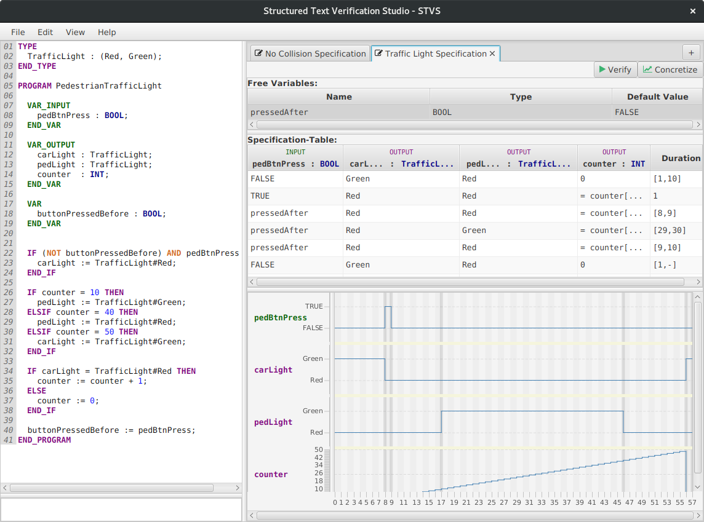

# A Graphical Interface for Proving Automation Software

**stvs** provides a graphical user interface for the verification
of [Structured Text](http://en.wikipedia.org/StructuredText)</a> source code
against generalized test tables.

It is a graphical frontend for the [geteta backend](../geteta), providing
a useful and beautiful user interface, e.g., a visualization of specification
violations.

stvs is open source, provided under **GNU Public License v3**.

## Features

* Verification of Structured Text against one or more specified generalized test tables</li>
* Transform a generalized test table into a concrete test table</li>
* Source Code Editor for Structured Text</li>

## Getting Started

Before you can use the full feature set you need to install z3, geteta, and nuXmv.

* **nuXmv** is the model checker distributed under an
	academic license. Obtain a copy
	from <a href="https://es-static.fbk.eu/tools/nuxmv/index.php?n=Download.Download">nuxmv.fbk.eu</a>
	and uncompress it.

* **z3** is available as binaries on
	their <a href="https://github.com/Z3Prover/z3/releases">website.</a>
	On Ubuntu you can install z3 through the package manager.
	(<code>sudo apt-get install z3</code>)

* **geteta** translates generalized test tables into models for nuXmv and runs
	the verification. You can obtain the latest version from [VerifAPS/geteta](../geteta/#downloads)

## Downloads

<dl> 
  <dt>Version 1.3.0 (20.07.2017)</dt>
  <dd>
    <a href="stverificationstudio-all-1.3.0.jar">stverificationstudio-all-1.3.0.jar</a>
    <ul>
      <li>Important: examples not finished</li>
      <li>Specification supports navigation with tab and cursor keys</li>
      <li>New UI of the specification table</li>
      <li>Bug fixes in syntax highlightning</li>
      <li>New XML-Namespace for config, session and specification files</li>
      <li>New action: Resize of the specification </li>
    </ul>
  </dd>
  <dt>Version 1.2.0-beta (14.04.2017)</dt>
  <dd>
    <a href="stverificationstudio-all-1.2.0-beta.jar">stverificationstudio-all-1.2.0-beta.jar</a>
    <ul>
      <li>add examples menu</li>
      <li>UI improvments in dialogs</li>
      <li>default value of free variables are now arbitrary cell constraints</li>
    </ul>
  </dd>
  <dt>Version 1.1.0</dt>
  <dd>
    <a href="stverificationstudio-all-1.1.0.jar">stverificationstudio-all-1.1.0.jar</a>
    <ul>
      <li>First public release</li>
    </ul>
  </dd>
</dl>

The sources are available
on <a href="https://github.com/VerifAPS/stvs">github.com/VerifAPS/stvs</a>.

<h3>Acknowledgement</h3>

 This software was designed and implemented during the
  course <a href="/teaching/pse/201617/automation/"><emph>Praxis der
  Softwareentwicklung</emph></a> by these students:

  <ul>
    <li>Benjamin Alt</li>
    <li>Carsten Csiky</li>
    <li>Lukas Fritsch</li>
    <li>Leon Kaucher</li>
    <li>Philipp Krüger</li>
  </ul>

<h3>Contact</h3>

Alexander Weigl &mdash; weigl@kit.edu

Feel free to use the <a href="https://github.com/VerifAPS/stvs/issues">issues tracker</a>.
